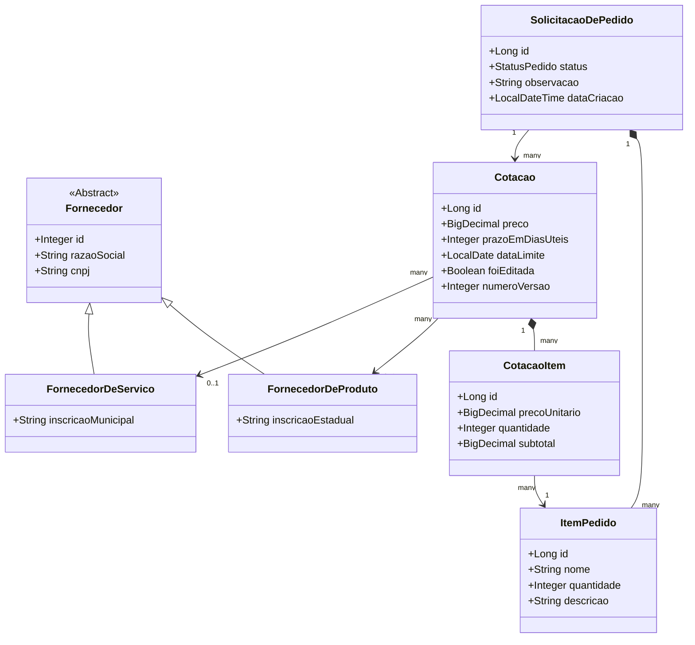
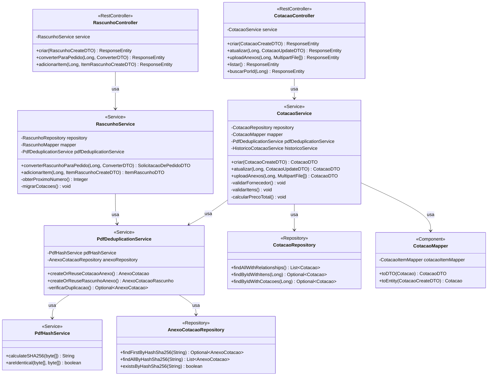
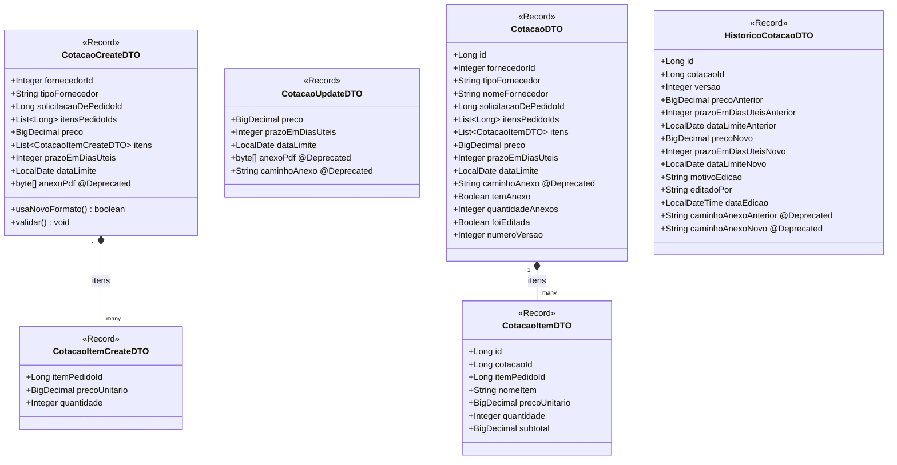
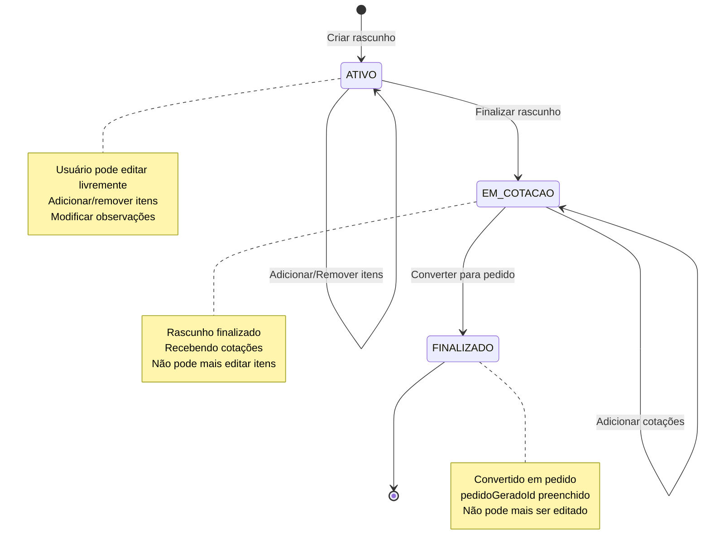
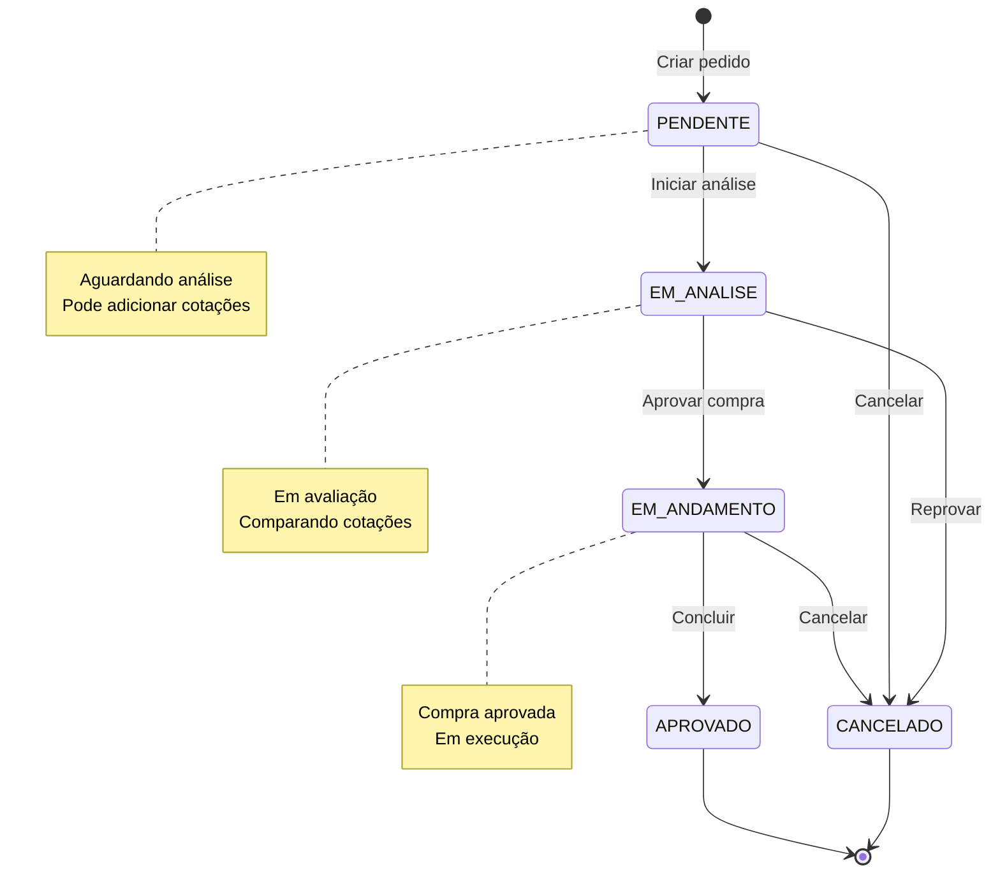
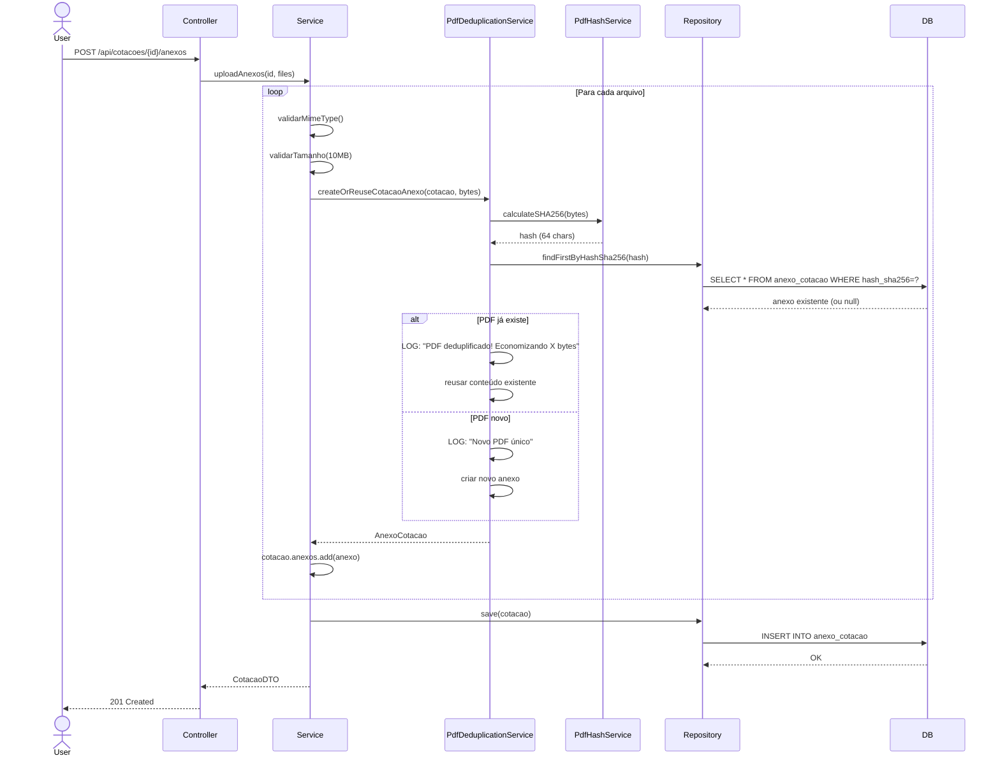

# Diagramas de Classes

## Diagrama de Classes Completo

```mermaid
classDiagram
    %% ==================== USUÁRIOS ====================
    class User {
        <<Entity>>
        -Long id
        -String username
        -String email
        -String password
        -String role
        +getId() Long
        +getUsername() String
        +getEmail() String
    }

    %% ==================== FORNECEDORES ====================
    class Fornecedor {
        <<Abstract>>
        #Integer id
        #String razaoSocial
        #String cnpj
        #Endereco endereco
        #Contato contato
        +getId() Integer
        +getRazaoSocial() String
    }

    class FornecedorDeProduto {
        <<Entity>>
        -String inscricaoEstadual
        +getInscricaoEstadual() String
    }

    class FornecedorDeServico {
        <<Entity>>
        -String inscricaoMunicipal
        +getInscricaoMunicipal() String
    }

    class Endereco {
        <<Entity>>
        -Long id
        -String cep
        -String logradouro
        -String numero
        -String complemento
        -String bairro
        -String cidade
        -String estado
    }

    class Contato {
        <<Entity>>
        -Long id
        -String nomeContato
        -String telefoneFixo
        -String celular
        -String email
    }

    %% ==================== RASCUNHOS ====================
    class Rascunho {
        <<Entity>>
        -Long id
        -User criador
        -String observacao
        -LocalDateTime dataCriacao
        -LocalDateTime dataModificacao
        -StatusRascunho status
        -Long pedidoGeradoId
        -Integer proximoNumeroItem
        -List~ItemRascunho~ itens
        -List~NumeroItemDisponivel~ numerosDisponiveis
        +adicionarItem() void
        +removerItem() void
        +obterProximoNumero() Integer
    }

    class ItemRascunho {
        <<Entity>>
        -Long id
        -Integer numeroItem
        -String nome
        -Integer quantidade
        -String descricao
        -String observacao
        -Rascunho rascunho
    }

    class NumeroItemDisponivel {
        <<Entity>>
        -Long id
        -Rascunho rascunho
        -Integer numeroItem
    }

    class StatusRascunho {
        <<Enumeration>>
        ATIVO
        EM_COTACAO
        FINALIZADO
    }

    class CotacaoRascunho {
        <<Entity>>
        -Long id
        -Rascunho rascunho
        -FornecedorDeProduto fornecedorProduto
        -FornecedorDeServico fornecedorServico
        -BigDecimal preco
        -Integer prazoEmDiasUteis
        -LocalDate dataLimite
        -List~AnexoCotacaoRascunho~ anexos
        -LocalDateTime dataCriacao
    }

    class AnexoCotacaoRascunho {
        <<Entity>>
        -Long id
        -CotacaoRascunho cotacaoRascunho
        -Integer ordem
        -byte[] conteudo
        -String nomeArquivo
        -String hashSha256
        +getHashSha256() String
    }

    %% ==================== PEDIDOS ====================
    class SolicitacaoDePedido {
        <<Entity>>
        -Long id
        -List~ItemPedido~ itens
        -Set~Cotacao~ cotacoes
        -StatusPedido status
        -String observacao
        -LocalDateTime dataCriacao
        -Long version
        +calcularTotal() BigDecimal
        +adicionarCotacao() void
    }

    class ItemPedido {
        <<Entity>>
        -Long id
        -String nome
        -Integer quantidade
        -String descricao
        -String observacao
        -SolicitacaoDePedido solicitacao
    }

    class StatusPedido {
        <<Enumeration>>
        PENDENTE
        EM_ANALISE
        EM_ANDAMENTO
        APROVADO
        CANCELADO
    }

    %% ==================== COTAÇÕES ====================
    class Cotacao {
        <<Entity>>
        -Long id
        -SolicitacaoDePedido solicitacao
        -FornecedorDeProduto fornecedorProduto
        -FornecedorDeServico fornecedorServico
        -List~CotacaoItem~ itens
        -BigDecimal preco
        -Integer prazoEmDiasUteis
        -LocalDate dataLimite
        -List~AnexoCotacao~ anexos
        -LocalDateTime dataCriacao
        -Long version
        -Boolean foiEditada
        -Integer numeroVersao
        -LocalDateTime dataUltimaEdicao
        -String motivoUltimaEdicao
        -String editadoPor
        +calcularPrecoTotal() BigDecimal
        +getFornecedorId() Integer
    }

    class CotacaoItem {
        <<Entity>>
        -Long id
        -Cotacao cotacao
        -ItemPedido itemPedido
        -BigDecimal precoUnitario
        -Integer quantidade
        -BigDecimal subtotal
        +calcularSubtotal() BigDecimal
    }

    class AnexoCotacao {
        <<Entity>>
        -Long id
        -Cotacao cotacao
        -Integer ordem
        -byte[] conteudo
        -String nomeArquivo
        -String hashSha256
        +getHashSha256() String
        +setHashSha256(String) void
    }

    %% ==================== HISTÓRICO ====================
    class HistoricoPedido {
        <<Entity>>
        -Long id
        -SolicitacaoDePedido solicitacao
        -User usuario
        -LocalDateTime dataModificacao
        -String tipoModificacao
        -String campoModificado
        -String valorAnterior
        -String valorNovo
        -String observacao
    }

    class HistoricoRascunho {
        <<Entity>>
        -Long id
        -Rascunho rascunho
        -User usuario
        -LocalDateTime dataModificacao
        -String tipoAcao
        -String descricao
        -Integer numeroItem
        -String nomeItem
        -String detalhes
    }

    class HistoricoCotacao {
        <<Entity>>
        -Long id
        -Long cotacaoId
        -Integer versao
        -BigDecimal precoAnterior
        -Integer prazoEmDiasUteisAnterior
        -LocalDate dataLimiteAnterior
        -BigDecimal precoNovo
        -Integer prazoEmDiasUteisNovo
        -LocalDate dataLimiteNovo
        -String motivoEdicao
        -String editadoPor
        -LocalDateTime dataEdicao
        -String hashAnexoPdfAnterior
        -String hashAnexoPdfNovo
    }

    %% ==================== SERVICES ====================
    class PdfHashService {
        <<Service>>
        +calculateSHA256(byte[]) String
        +areIdentical(byte[], byte[]) boolean
    }

    class PdfDeduplicationService {
        <<Service>>
        -PdfHashService pdfHashService
        -AnexoCotacaoRepository repository
        +createOrReuseCotacaoAnexo(Cotacao, byte[], Integer, String) AnexoCotacao
        +createOrReuseRascunhoAnexo(CotacaoRascunho, byte[], Integer, String) AnexoCotacaoRascunho
        +convertRascunhoAnexoWithDeduplication(Cotacao, AnexoCotacaoRascunho) AnexoCotacao
    }

    class CotacaoService {
        <<Service>>
        -CotacaoRepository repository
        -PdfDeduplicationService pdfDeduplicationService
        -HistoricoCotacaoService historicoService
        +criar(CotacaoCreateDTO) CotacaoDTO
        +atualizar(Long, CotacaoUpdateDTO) CotacaoDTO
        +uploadAnexos(Long, MultipartFile[]) CotacaoDTO
        +vincularItens(Long, List~Long~) CotacaoDTO
    }

    class RascunhoService {
        <<Service>>
        -RascunhoRepository repository
        -PdfDeduplicationService pdfDeduplicationService
        +converterRascunhoParaPedido(Long, ConverterDTO) SolicitacaoDePedidoDTO
        +adicionarItem(Long, ItemRascunhoCreateDTO) ItemRascunhoDTO
        +removerItem(Long, Long) void
    }

    %% ==================== RELACIONAMENTOS ====================

    %% Herança
    Fornecedor <|-- FornecedorDeProduto
    Fornecedor <|-- FornecedorDeServico

    %% Composição Fornecedor
    Fornecedor "1" *-- "1" Endereco : possui
    Fornecedor "1" *-- "1" Contato : possui

    %% Rascunho
    User "1" --> "0..*" Rascunho : cria
    Rascunho "1" *-- "0..*" ItemRascunho : contém
    Rascunho "1" *-- "0..*" NumeroItemDisponivel : pool
    Rascunho "1" --> "0..*" CotacaoRascunho : cotacoes
    Rascunho --> StatusRascunho : status

    %% Cotação Rascunho
    CotacaoRascunho "0..*" --> "0..1" FornecedorDeProduto : fornecedor
    CotacaoRascunho "0..*" --> "0..1" FornecedorDeServico : fornecedor
    CotacaoRascunho "1" *-- "0..*" AnexoCotacaoRascunho : anexos

    %% Pedido
    SolicitacaoDePedido "1" *-- "1..*" ItemPedido : itens
    SolicitacaoDePedido "1" --> "0..*" Cotacao : cotacoes
    SolicitacaoDePedido --> StatusPedido : status

    %% Cotação
    Cotacao "0..*" --> "0..1" FornecedorDeProduto : fornecedor
    Cotacao "0..*" --> "0..1" FornecedorDeServico : fornecedor
    Cotacao "1" *-- "1..*" CotacaoItem : itens
    Cotacao "1" *-- "0..*" AnexoCotacao : anexos
    CotacaoItem "0..*" --> "1" ItemPedido : referencia

    %% Histórico
    HistoricoPedido "0..*" --> "1" SolicitacaoDePedido : pedido
    HistoricoPedido "0..*" --> "1" User : usuario
    HistoricoRascunho "0..*" --> "1" Rascunho : rascunho
    HistoricoRascunho "0..*" --> "1" User : usuario

    %% Services
    PdfDeduplicationService --> PdfHashService : usa
    PdfDeduplicationService --> AnexoCotacao : cria/reutiliza
    PdfDeduplicationService --> AnexoCotacaoRascunho : cria/reutiliza
    CotacaoService --> PdfDeduplicationService : usa
    RascunhoService --> PdfDeduplicationService : usa
```

## Diagrama de Entidades do Domínio

## Diagrama de Serviços e Camadas

## Diagrama de DTOs

## Diagrama de Estados - Rascunho

## Diagrama de Estados - Pedido

## Diagrama de Sequência - Upload de PDF com Deduplificação

---

**Próximo:** [Banco de Dados](./database-schema.md)
