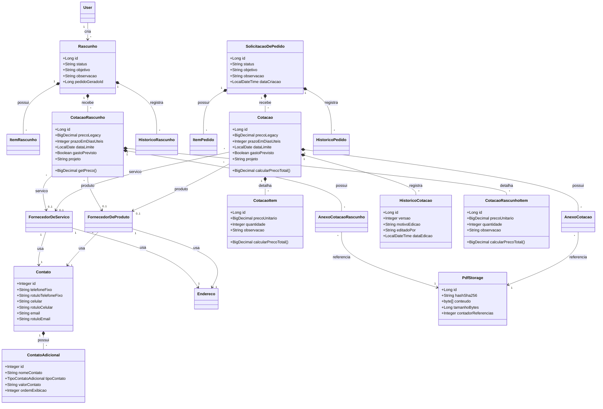

# Class Diagram

## Notes

- `Cotacao` e `CotacaoRascunho` aceitam fornecedor de produto ou servico, nunca os dois ao mesmo tempo.
- O valor total das cotacoes pode vir do preco legado ou ser calculado a partir dos itens.
- O modelo de contato foi ampliado com rotulos nos contatos principais e lista de contatos adicionais.
- Anexos PDF usam armazenamento deduplicado via `PdfStorage`.

