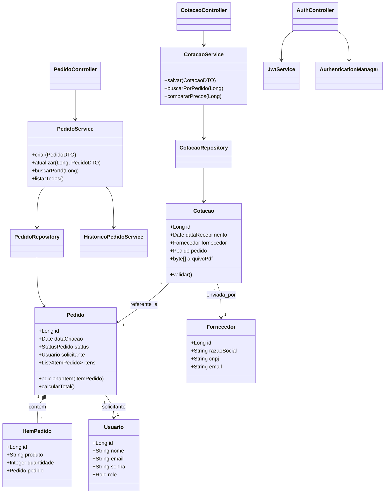

# Diagrama de Classes - Gestor de Compras

```mermaid
classDiagram
    %% Relationships
    PedidoController --> PedidoService
    PedidoService --> PedidoRepository
    PedidoService --> HistoricoPedidoService
    PedidoRepository --> Pedido
    Pedido "1" *-- "*" ItemPedido : contem
    Pedido "1" --> "1" Usuario : solicitante
    
    CotacaoController --> CotacaoService
    CotacaoService --> CotacaoRepository
    CotacaoRepository --> Cotacao
    Cotacao "*" --> "1" Pedido : referente_a
    Cotacao "*" --> "1" Fornecedor : enviada_por
    
    AuthController --> JwtService
    AuthController --> AuthenticationManager
    
    %% Classes
    class Pedido {
        +Long id
        +Date dataCriacao
        +StatusPedido status
        +Usuario solicitante
        +List~ItemPedido~ itens
        +adicionarItem(ItemPedido)
        +calcularTotal()
    }
    
    class ItemPedido {
        +Long id
        +String produto
        +Integer quantidade
        +Pedido pedido
    }
    
    class Cotacao {
        +Long id
        +Date dataRecebimento
        +Fornecedor fornecedor
        +Pedido pedido
        +byte[] arquivoPdf
        +validar()
    }
    
    class Fornecedor {
        +Long id
        +String razaoSocial
        +String cnpj
        +String email
    }
    
    class Usuario {
        +Long id
        +String nome
        +String email
        +String senha
        +Role role
    }

    class PedidoService {
        +criar(PedidoDTO)
        +atualizar(Long, PedidoDTO)
        +buscarPorId(Long)
        +listarTodos()
    }

    class CotacaoService {
        +salvar(CotacaoDTO)
        +buscarPorPedido(Long)
        +compararPrecos(Long)
    }
```