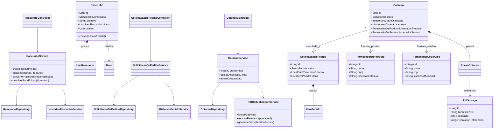

# Diagrama de Classes - Gestor de Compras

## Descrição da Arquitetura

- **Controller Layer**: Endpoints REST que validam DTOs e coordenam chamadas aos serviços.
- **Service Layer**: Contém a lógica de negócio, orquestração de transações e regras de segurança.
- **Repository Layer**: Interface com o banco de dados via Spring Data JPA.
- **Model Layer**: Entidades JPA que representam o domínio do sistema.
- **DTOs**: Objetos de transferência para comunicação entre Frontend e Backend.
