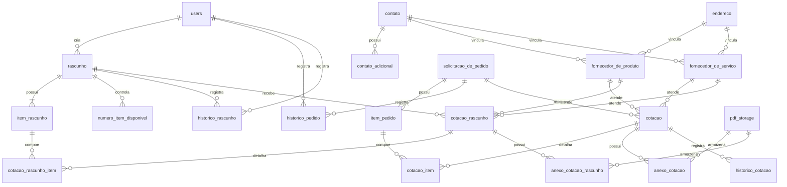

# Database Schema

## Main tables

### Security and base data

- `users`: usuarios, roles e status de ativacao.
- `contato`: email, telefone fixo, celular e rotulos dos contatos principais.
- `contato_adicional`: contatos extras por fornecedor, com tipo e ordem de exibicao.
- `endereco`: endereco completo usado por fornecedores.

### Suppliers

- `fornecedor_de_produto`
- `fornecedor_de_servico`

Cada fornecedor referencia `endereco` e `contato`.

### Draft flow

- `rascunho`
- `item_rascunho`
- `numero_item_disponivel`
- `historico_rascunho`
- `cotacao_rascunho`
- `cotacao_rascunho_item`
- `anexo_cotacao_rascunho`

`cotacao_rascunho_item` resolve o relacionamento entre cotacao de rascunho e item do rascunho, com preco unitario, quantidade e observacao por item.

### Purchase request flow

- `solicitacao_de_pedido`
- `item_pedido`
- `historico_pedido`
- `cotacao`
- `cotacao_item`
- `historico_cotacao`
- `anexo_cotacao`

`cotacao_item` resolve o relacionamento entre cotacao final e item do pedido, com granularidade por item.

### File storage

- `pdf_storage`: armazenamento centralizado de anexos por hash SHA-256.

## Relevant migrations

- `V1__Initial_Setup.sql`: schema base consolidado.
- `V3__Add_Contato_Adicional.sql`: suporte a contatos adicionais.
- `V4__Add_Rotulos_Contato_Principal.sql`: rotulos para telefone fixo, celular e email.

## Practical notes

- `cotacao.preco` e `cotacao_rascunho.preco` existem por compatibilidade, mas o valor total pode ser calculado pelos itens.
- Historico de cotacao registra versao, motivo da edicao, autor e snapshots relevantes.
- A estrutura atual de contato sustenta a exibicao detalhada do fornecedor no frontend e a copia de valores para a area de transferencia na release `3.2.1`.

