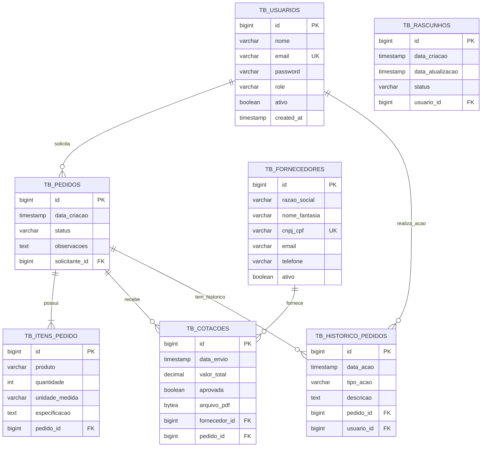

# Esquema do Banco de Dados

```mermaid
erDiagram
    TB_USUARIOS ||--o{ TB_PEDIDOS : solicita
    TB_USUARIOS ||--o{ TB_HISTORICO_PEDIDOS : realiza_acao
    TB_PEDIDOS ||--|{ TB_ITENS_PEDIDO : possui
    TB_PEDIDOS ||--o{ TB_COTACOES : recebe
    TB_FORNECEDORES ||--o{ TB_COTACOES : fornece
    TB_PEDIDOS ||--o{ TB_HISTORICO_PEDIDOS : tem_historico

    TB_USUARIOS {
        bigint id PK
        varchar nome
        varchar email UK
        varchar password
        varchar role
        boolean ativo
        timestamp created_at
    }

    TB_FORNECEDORES {
        bigint id PK
        varchar razao_social
        varchar nome_fantasia
        varchar cnpj_cpf UK
        varchar email
        varchar telefone
        boolean ativo
    }

    TB_PEDIDOS {
        bigint id PK
        timestamp data_criacao
        varchar status
        text observacoes
        bigint solicitante_id FK
    }

    TB_ITENS_PEDIDO {
        bigint id PK
        varchar produto
        int quantidade
        varchar unidade_medida
        text especificacao
        bigint pedido_id FK
    }

    TB_COTACOES {
        bigint id PK
        timestamp data_envio
        decimal valor_total
        boolean aprovada
        bytea arquivo_pdf
        bigint fornecedor_id FK
        bigint pedido_id FK
    }
    
    TB_HISTORICO_PEDIDOS {
        bigint id PK
        timestamp data_acao
        varchar tipo_acao
        text descricao
        bigint pedido_id FK
        bigint usuario_id FK
    }

    TB_RASCUNHOS {
        bigint id PK
        timestamp data_criacao
        timestamp data_atualizacao
        varchar status
        bigint usuario_id FK
    }
```
