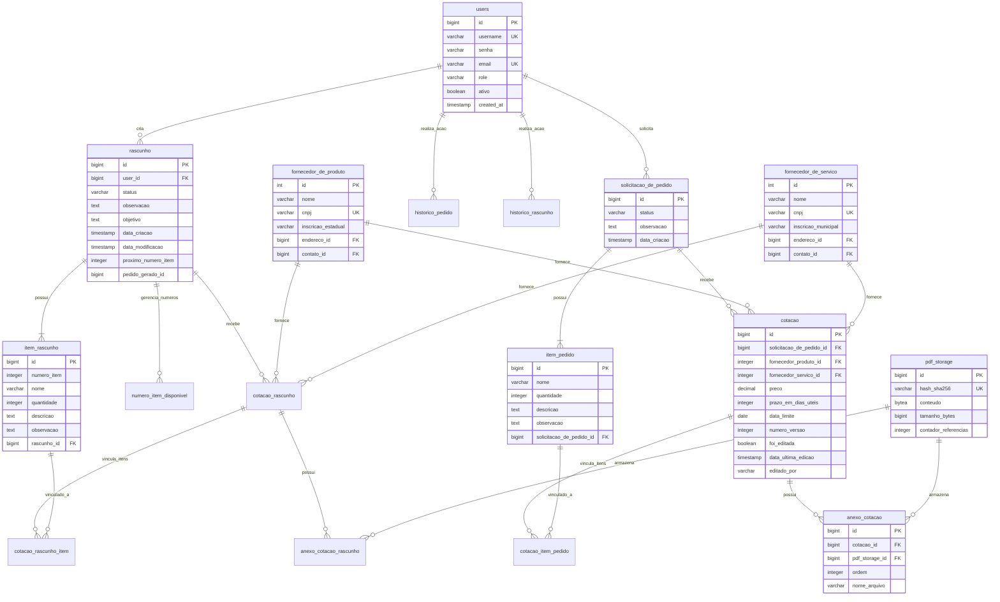

# Esquema do Banco de Dados

## Descrição das Tabelas Principais

- **users**: Armazena os usuários do sistema com roles (ADMIN, COMPRADOR, USUARIO, APROVADOR).
- **rascunho**: Área de trabalho preliminar para montagem de pedidos.
- **solicitacao_de_pedido**: Pedidos oficializados no sistema.
- **cotacao / cotacao_rascunho**: Registros de preços e prazos de fornecedores.
- **pdf_storage**: Implementação de *Content-Addressable Storage* (CAS) para deduplicação de anexos.
- **fornecedor_de_produto / fornecedor_de_servico**: Especializações de fornecedores conforme o tipo de entrega.