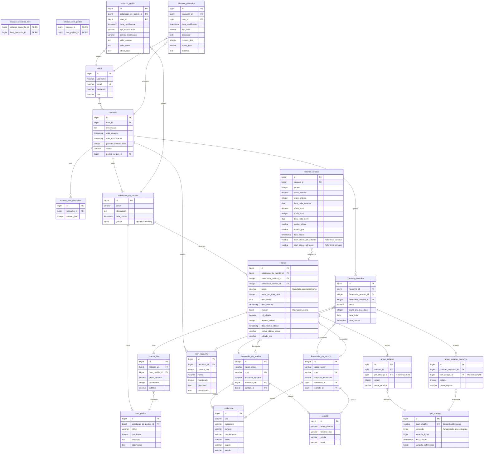

# Esquema do Banco de Dados

## Diagrama Entidade-Relacionamento (ER)



## Estrutura Detalhada das Tabelas

... (Tabelas users, endereco, contato, fornecedores, rascunho, item_rascunho, numero_item_disponivel, cotacao_rascunho mantidas iguais) ...

---

### 10. Tabela: `pdf_storage` (NOVO)
**Descrição:** Armazenamento centralizado de PDFs com Content-Addressable Storage (CAS)

| Coluna | Tipo | Constraints | Descrição |
|--------|------|-------------|-----------|
| `id` | BIGSERIAL | PRIMARY KEY | Identificador único |
| `hash_sha256` | VARCHAR(64) | NOT NULL, UNIQUE | Hash do conteúdo (chave do CAS) |
| `conteudo` | BYTEA | NOT NULL | Bytes do arquivo PDF |
| `tamanho_bytes` | BIGINT | NOT NULL | Tamanho do arquivo |
| `data_criacao` | TIMESTAMP | DEFAULT NOW() | Data de armazenamento |
| `contador_referencias` | BIGINT | DEFAULT 0 | Número de anexos usando este PDF |

**Índices:**
```sql
CREATE UNIQUE INDEX idx_pdf_storage_hash ON pdf_storage(hash_sha256);
```

**Deduplificação Real:**
- O conteúdo é armazenado **uma única vez** nesta tabela.
- `anexo_cotacao` e `anexo_cotacao_rascunho` apenas referenciam o ID daqui.
- Economia massiva de espaço e integridade garantida pelo hash.

---

### 11. Tabela: `anexo_cotacao_rascunho`
**Descrição:** Vínculo entre cotação de rascunho e PDF armazenado

| Coluna | Tipo | Constraints | Descrição |
|--------|------|-------------|-----------|
| `id` | BIGSERIAL | PRIMARY KEY | Identificador único |
| `cotacao_rascunho_id` | BIGINT | FK → cotacao_rascunho(id) | Cotação pai |
| `pdf_storage_id` | BIGINT | FK → pdf_storage(id) | Referência ao conteúdo |
| `ordem` | INTEGER | DEFAULT 0 | Ordem de exibição |
| `nome_arquivo` | VARCHAR(255) | | Nome original (metadado) |

**Nota:**
Múltiplos anexos (mesmo de cotações diferentes) podem apontar para o mesmo `pdf_storage_id` se o conteúdo for idêntico.

---

### 16. Tabela: `anexo_cotacao`
**Descrição:** Vínculo entre cotação formal e PDF armazenado

| Coluna | Tipo | Constraints | Descrição |
|--------|------|-------------|-----------|
| `id` | BIGSERIAL | PRIMARY KEY | Identificador único |
| `cotacao_id` | BIGINT | FK → cotacao(id) | Cotação pai |
| `pdf_storage_id` | BIGINT | FK → pdf_storage(id) | Referência ao conteúdo |
| `ordem` | INTEGER | DEFAULT 0 | Ordem de exibição |
| `nome_arquivo` | VARCHAR(255) | | Nome original (metadado) |

---

... (Restante das tabelas mantidas) ...

## Migrations Aplicadas

| Versão | Arquivo | Descrição |
|--------|---------|-----------|
| V1 | create-initial-schema.sql | Users, endereco, contato |
| V2 | create-fornecedores-tables.sql | Fornecedores produto/serviço |
| V3 | create-pedidos-rascunhos-cotacoes.sql | Pedidos, rascunhos, cotações |
| V4 | create-anexo-cotacao-rascunho-table.sql | Anexos rascunho (legado) |
| V5 | add-status-to-rascunho.sql | Status em rascunhos |
| V6 | create-anexo-cotacao-table.sql | Anexos cotação (legado) |
| V7 | add-soft-delete-to-historicos.sql | Soft delete históricos |
| V8 | refactor-cotacao-to-use-cotacao-item.sql | CotacaoItem (preços individuais) |
| V9 | add-version-columns-for-optimistic-locking.sql | Optimistic locking |
| V10 | add-version-to-cotacao-rascunho.sql | Version em rascunho |
| V11 | add-cotacao-audit-fields.sql | Auditoria de cotações |
| V13 | rename-username-to-nome.sql | Ajuste nome usuário |
| V14 | implement-content-addressable-storage-for-pdfs.sql | **Nova arquitetura CAS (pdf_storage)** |

---

**Próximo:** [API REST](./api-endpoints.md)